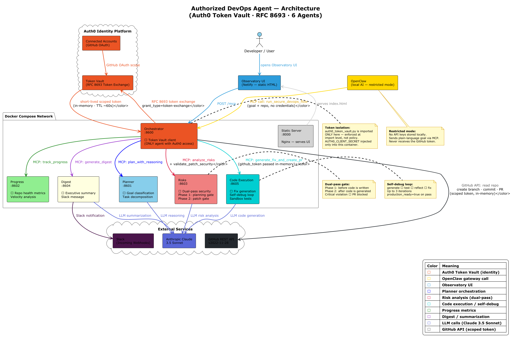
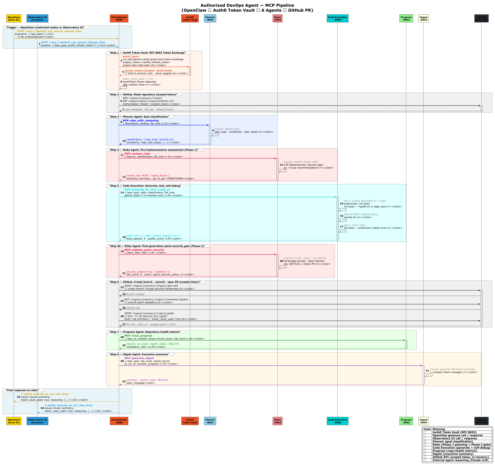

# Authorized DevOps Agent

[](https://auth0.com)
[](https://datatracker.ietf.org/doc/html/rfc8693)
[](https://www.anthropic.com)
[](https://python.org)
[](https://docker.com)
[](https://authorizedtoact.devpost.com)

**The secure intermediary agent for local AI systems.**  
Six specialized AI agents orchestrate GitHub DevOps workflows on behalf of authenticated users — with every external API call authorized through **Auth0 Token Vault** and RFC 8693 Token Exchange. Local AI models like OpenClaw never touch your credentials.

---

## 📖 Contents

- [The Problem This Solves](#-the-problem-this-solves)
- [What It Does](#-what-it-does)
- [Architecture Overview](#-architecture-overview)
- [OpenClaw Integration Pattern](#-openclaw-integration-pattern)
- [How Auth0 Token Vault Is Used](#-how-auth0-token-vault-is-used)
- [Agent Pipeline](#-agent-pipeline)
- [MCP Pipeline Sequence](#-mcp-pipeline-sequence)
- [Security Architecture](#-security-architecture)
- [How It Meets the Hackathon Requirements](#-how-it-meets-the-hackathon-requirements)
- [Running the Project](#-running-the-project)
- [Tech Stack](#-tech-stack)
- [Documentation](#-documentation)
- [License](#-license)

---

## 👉 The Problem This Solves

The hackathon brief describes it precisely:

> **Authorized to Act — Hackathon Overview**  
> Keep OpenClaw in restricted mode and let it communicate with your apps in the outside world through an intermediary agent you build.

**This project is that intermediary agent.**

Local AI models — OpenClaw, on-device assistants, browser agents — are increasingly powerful. But they face a fundamental security constraint: they cannot safely hold long-lived API credentials. Giving a local model a GitHub PAT means that token lives on disk, in memory, in logs — on a machine you may not fully control. That is why people are buying Mac Minis just to run sovereign AI: to isolate the model from the internet.

But then the model cannot act on anything real.

```text
Option A: Give the agent a long-lived token  → credential exposure risk
Option B: Keep the agent offline             → agent can't do anything useful
Option C: Auth0 Token Vault as a gateway     → agent acts safely, credentials stay with Auth0
```

This project implements **Option C**.

---

## 🔨 What It Does

**Authorized DevOps Agent** is a **secure authorization gateway for AI agents**. It allows a local AI system (such as OpenClaw running on a Mac Mini) to perform real GitHub operations — analyse a repository, generate a code fix, run tests, open a Pull Request — **without ever receiving a long-lived credential**.

A user or an upstream local AI provides two plain‑language inputs:

```text
Repository:  acme-corp/web-app
Goal:        Fix the JWT token validation vulnerability
```

The system runs a **six‑agent autonomous pipeline**:

1. **Auth0 Token Vault** — RFC 8693 Token Exchange issues a scoped, short‑lived GitHub token, held in memory only  
2. **Planner** — classifies the goal, decomposes it into tasks, estimates complexity  
3. **Risks** — pre‑implementation security assessment before any code is written  
4. **Code Execution** — generates the fix, writes tests, runs them in a sandbox, self‑debugs until all pass  
5. **Orchestrator** — creates branch, commits patches, opens the GitHub Pull Request  
6. **Progress + Digest** — repository health metrics and human‑readable executive summary  

https://github.com/Exsellent/Authorized-DevOps-Agent/blob/main/assets/demo-video-agents.mp4

The upstream agent (OpenClaw or any AI) never sees the GitHub token. The token exists for one request, is used, then garbage‑collected.


---

## 🏗️ Architecture Overview



This diagram shows how OpenClaw communicates with the Authorized DevOps Agent, how the Orchestrator interacts with Auth0 Token Vault, and how the six specialized agents collaborate inside the Docker Compose network.

---

## 🛠 ⚓ OpenClaw Integration Pattern

```text
OpenClaw (running locally on Mac Mini — restricted mode)
         │
         │  plain-language DevOps goal via MCP call
         ▼
┌─────────────────────────────────────────┐
│     Authorized DevOps Agent             │  ◄── THIS PROJECT
│                                         │
│  Orchestrator ──► Auth0 Token Vault     │
│       │               │                 │
│       │        short-lived GitHub token │
│       │         (in-memory, ~60s TTL)   │
│       │                                 │
│  Planner · Risks · Code Exec            │
│  Progress · Digest                      │
└─────────────────────────────────────────┘
         │
         ▼
    GitHub REST API
```

OpenClaw stays in **restricted mode** — no API keys, no credentials, no persistent secrets on the local machine. It delegates all external API actions to this gateway. The gateway handles authentication, authorization, audit trail, and security policy enforcement.

**What this achieves for OpenClaw users:**

- **Agent containment** — if the local model is compromised or hallucinates a tool call, it cannot exfiltrate credentials it never had  
- **Minimal privilege** — each token is scoped to `repo read:user` with a short TTL; the model cannot escalate beyond what was granted  
- **Zero‑trust execution** — every run starts a fresh RFC 8693 exchange; nothing persists from previous requests  
- **Full observability** — every agent decision is logged in the Observatory UI reasoning trail; nothing happens in a black box  

---

## Auth0⃣ ⚙️ How Auth0 Token Vault Is Used

Token Vault is the **architectural foundation**, not a feature added at the end. No pipeline run proceeds without a successful RFC 8693 Token Exchange.

The token flow per pipeline run:

1. The user connects their GitHub account to Auth0 via **Connected Accounts**  
2. When a pipeline is triggered (by the user or by OpenClaw), the Orchestrator calls the Token Vault endpoint with:  
   `grant_type=urn:ietf:params:oauth:grant-type:token-exchange`  
3. Auth0 returns a short‑lived, scoped GitHub access token  
4. The token is held in a frozen Python dataclass in memory — its `__repr__` never exposes the value  
5. All GitHub API calls in that request use this token  
6. When the request completes, the token is garbage‑collected — never written to disk, database, or any log  

The field `token_vault_used: true` appears in every API response and in the body of every created Pull Request — explicit, verifiable proof that the Token Vault exchange ran.

`AUTH0_CLIENT_SECRET` is injected **only** into the Orchestrator container at the Docker Compose level. Sub‑agent containers are structurally isolated from it even if compromised.

---

## 🏭 Agent Pipeline

| Agent                 | Port   | Responsibility                                                                                                                                                                                  |
|-----------------------|--------|-------------------------------------------------------------------------------------------------------------------------------------------------------------------------------------------------|
| 🎭 **Orchestrator**   | 8600   | Sole owner of the Token Vault client. Coordinates all agents. Reads repo, creates branch, commits patch files, opens PR.                                                                        |
| 📋 **Planner**        | 8601   | Classifies the goal (security_fix / bug_fix / dependency_update / feature), decomposes into subtasks, estimates effort and complexity.                                                          |
| ⚠️ **Risks**          | 8603   | **Dual‑pass.** Phase 1: planning‑phase risk assessment (design, CVE, integration). Phase 2: post‑generation patch gate — scans generated files for forbidden patterns before the PR is created. |
| 📟 **Code Execution** | 8605   | Generates Python fix, writes tests, runs them in isolated subprocesses, self‑corrects through a reflection loop (up to 3 iterations). Returns base64‑encoded patch files.                       |
| 📊 **Progress**       | 8602   | Calculates repo health metrics. Classifies velocity and urgency. Determines escalation requirements.                                                                                            |
| 📝 **Digest**         | 8604   | Generates Markdown executive summary and compact Slack message from all agent outputs.                                                                                                          |

---

## 🏭 🔁 MCP Pipeline Sequence

The sequence diagram illustrates the full 14‑step secure DevOps flow: OpenClaw → Orchestrator → Token Vault → Planner → Risks → Code Execution → GitHub → Digest.



---

## 🔐 Security Architecture

### ☢️ Token Isolation (import‑level enforcement)

`auth0_token_vault.py` is imported **only** in `orchestrator/agent.py`. Sub‑agents are structurally incapable of accessing Token Vault regardless of what code they run or what payload they receive.

### 💿 ⚠ Dual‑Pass Risk Gate

- **Phase 1 (before code generation)** — planning assessment: identifies design risks, CVE dependencies, integration fragility. Returns a go/no‑go recommendation.
- **Phase 2 (after code generation)** — patch security scan: checks generated files for `eval(`, `exec(`, hardcoded `password =`, `api_key =`, shell injection patterns. Any **critical** violation blocks the PR entirely.

### 🕹 ✍ Log Redaction

All dictionary data passes through a `_safe_deep()` function before any log statement or reasoning trail entry. This recursively redacts sensitive keys in nested dicts and lists. Keys in `{github_token, access_token, refresh_token, auth0_refresh_token, auth0_access_token}` are replaced with `***REDACTED***`.

### 📦 Container Isolation

Each agent is a separate Docker container with no shared volumes and no access to sibling containers' environment variables. The only communication channel is HTTP on an internal Docker network.

---

## 📄 How It Meets the Hackathon Requirements

### Token Vault ✓
Token Vault is the entry point to every pipeline run. No code touches GitHub until the RFC 8693 exchange completes.

### Intermediary Agent for Local AI (OpenClaw) ✓
The system is explicitly designed as the intermediary agent described in the hackathon brief. A local model (OpenClaw) sends a goal; this gateway handles all API authorization via Auth0. The local model stays in restricted mode.

### Agents Act on Behalf of Users ✓
The system acts on a real GitHub repository — reading files, writing code, creating branches, opening PRs — under the delegated identity of the authenticated user, not a shared service account.

### Observable and Auditable ✓
Every agent appends steps to a shared reasoning trail. The Observatory UI renders this in real time. Nothing happens in a black box.

---

## 🚀 Running the Project

### 📄 Requirements

- Docker and Docker Compose
- Auth0 tenant with Token Vault and Connected Accounts (GitHub) enabled
- Anthropic API key (or OpenRouter as fallback)
- A GitHub repository to target

### Start

```shell
cp .env.example .env
# fill in: AUTH0_DOMAIN, AUTH0_CLIENT_ID, AUTH0_CLIENT_SECRET,
#          AUTH0_REFRESH_TOKEN, ANTHROPIC_API_KEY
docker compose up --build
open http://localhost:8000
```

### OpenClaw MCP Call

```json
POST http://orchestrator:8600/mcp
{
  "method": "run_secure_devops_flow",
  "params": {
    "repo":  "owner/repo",
    "goal":  "Fix the security vulnerability in auth middleware"
  }
}
```

The Orchestrator resolves the Auth0 token from its environment — OpenClaw never sees it.

### Live Demo

Observatory UI: [https://authorized-devops-agent.netlify.app](https://authorized-devops-agent.netlify.app)  
*(Demo Mode — full 14‑step pipeline simulation, no credentials required)*

---

## 📡 Tech Stack

| Component         | Technology                                                       |
|-------------------|------------------------------------------------------------------|
| Identity & Auth   | Auth0 Token Vault · RFC 8693 Token Exchange · Connected Accounts |
| AI / LLM          | Anthropic Claude 3.5 Sonnet                                      |
| Agent Protocol    | MCP (Model Context Protocol) over HTTP                           |
| Runtime           | Python 3.12 · FastAPI · asyncio · httpx                          |
| Infrastructure    | Docker Compose                                                   |
| GitHub API        | REST API v2022‑11‑28                                             |
| Notifications     | Slack Incoming Webhooks                                          |
| Frontend          | Vanilla JS · Observatory UI (Netlify)                            |

---

## 📚 Documentation

- [Architecture Diagram (PlantUML)](docs/diagrams/architecture.puml)
- [Pipeline Sequence (PlantUML)](docs/diagrams/sequence.puml)
- [API Reference](docs/API.md)
- [Deployment Guide](docs/DEPLOYMENT.md)
- [Architecture Notes](docs/Architecture.md)
- [Agent Comparison](docs/AGENT_COMPARISON.md)

---

## 📝 License

MIT License — see [LICENSE](LICENSE) file for details.

---

*Built ❤️ for the [Authorized to Act: Auth0 for AI Agents Hackathon](https://authorizedtoact.devpost.com/)*  
*Live demo: [https://authorized-devops-agent.netlify.app](https://authorized-devops-agent.netlify.app)*
